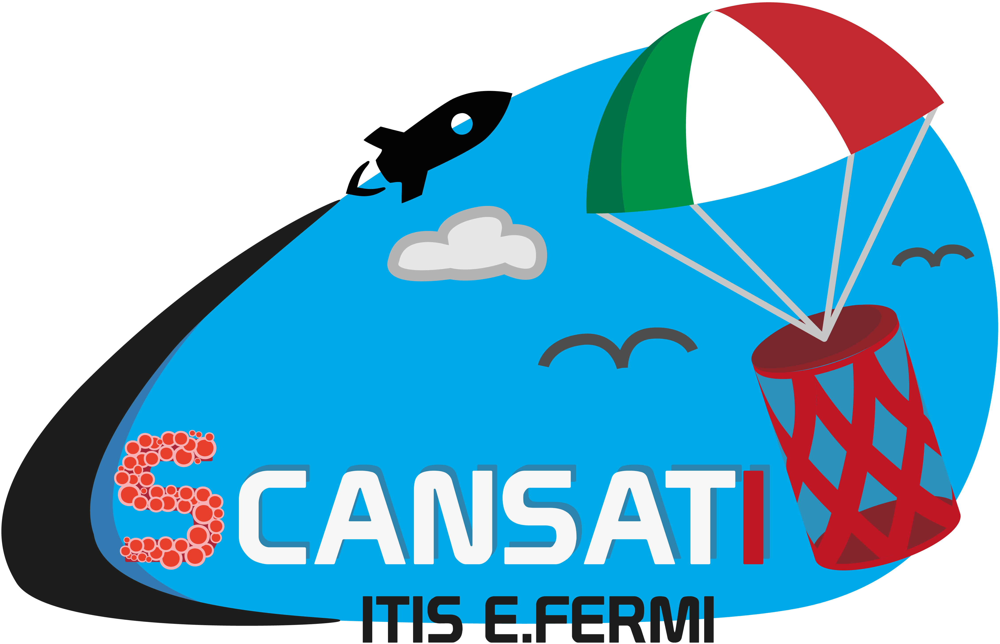
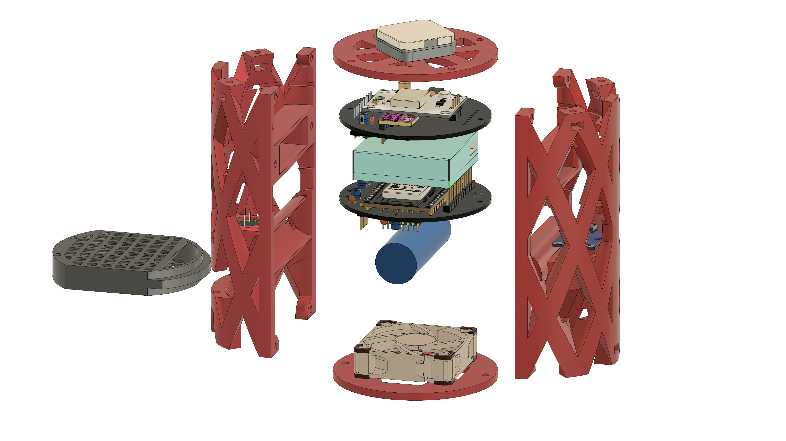
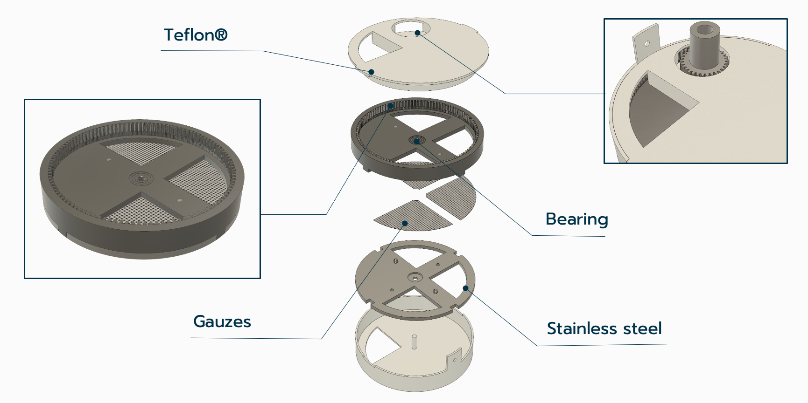

# Cansat 2021

A project by sCANSATi team.

  

_Awarded Highest Technical Achievement in the European Cansat Competition of 2021_

## Description

A Cansat is a small probe (its dimensions are roughly those of a soda can) that is launched from an altitude of 1000
meters. Cansats usually carry out a scientific mission onboard during their descent, and communicate with the ground
station via a radio link.

Our mission was built around three goals: carry out an environmental analysis, a bacteriological sampling of the air
and proof-test LoRa for roaming and long range communications.

## Design

The can was entirely designed from scratch by the team. Its outer shell was 3D printed in ABS plastic.
Custom hardware was designed to achieve the different goals: temperature measurement, absolute positioning and
handling of sensors on board. Every component was fitted on a custom printed circuit board, also designed by us.

_Figure 1: exploded can showing its internals. The upper layer board contained the sensors, the lower layer housed the
microcontroller and radio module. On the left you can see the bacteria tray, that held a gauze used to capture bacteria
in the air, blowed by the fan below._ 

## Hardware and software

An ESP32 is the core component of our small can: its job is to handle data coming from each sensor, and send it to
the ground station via a radio link.
Using FreeRTOS and ESP-IDF, we custom tailored a software for our needs and to exploit the full power of the ESP32
(which is a very powerful dual-core microcontroller).

To find out more on the software side, we published our source code. Feel free to take a look at
[cansat_firmware](https://github.com/ITIS-Enrico-Fermi/cansat_firmware).

## National Flight Competition

The first step of the competition is the _National Flight_. Three teams from Italy competed to pass on to the
European Competition.

This flight validated our design. Data gathered from the National Flight Competition is available in this repository
in the [flight.csv](data/flight.csv) file.

## European Competition

Unfortunately the European Competition took place online solely. The judges presented us a new challenge based on
the flaws they found on our project from the National Competition.

The challenge was about the gauze compartment; the jury arised some doubts about a possible contamination from external
factors. They posed us three questions:

> How would you change your design or operating procedure to avoid contamination to the gauze from the rest of the CanSat internals and environmental dust?

> Can you think of a way to contain/seal the gauze after landing to avoid contamination while on ground and waiting for recovery?                                             

>The part of this mission related to bacteria seems to verify the presence of bacteria. Could we take this one step further and measure the presence of bacteria at different altitudes?

### Improvements

To address the three questions at once, we redesigned the gauze compartment; which became a bacteriological module.

_Slide from the European presentation, showing the bacteria module under the hood_

The module consists of 4 parts: a top and bottom part to seal everything. and the two gauze holder frames.

The bottom part is made up of Teflon and presents a hole for gauze exposure and a fixed shaft in the center.
On top of that there are two circular frames made up of stainless steel, held together by two screws; they form the gauzes container

The upper grid is the key part of the module. It integrates a cogwheel on the border that allows to control the rotation of the gauzes.
We chose steel because these parts are really small and must be very precise but resistant.
Then, on top of that, another part ensures the total enclosure, and features a hole to position the gear.

## Awards

The team was awarded with the **Highest Technical Achievement** by M. Bandecchi, Lead System Engineer at ESA.

Read the proclamation speech, and watch the service we had on national television, on
[our school website](https://www.fermi-mo.edu.it/pagine/cansat-2021).

## Report

Our report for the European Competition is included in this repository. You may read it for all the details about
the project.

[sCANSATi European Competition Report](report.pdf)
